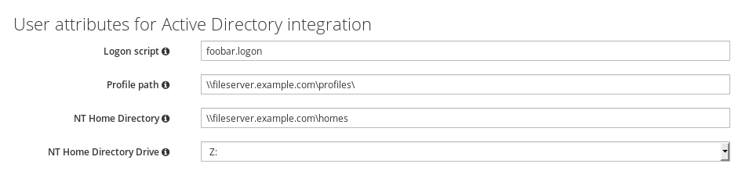

# A plugin to manage trust attributes for users in freeIPA

This plugin for FreeIPA makes trust attributes associated with each IPA user
editable via Web UI and CLI as part of a self-service.

Steps to build plugin

    $ sudo dnf -y install rpm-build rpmdevtools
    $ rpmdev-setuptree
    $ git clone https://github.com/abbra/freeipa-user-trust-attributes.git
    $ cd freeipa-user-trust-attributes
    $ git archive --prefix freeipa-user-trust-attributes-plugin-0.0.1/ -o freeipa-user-trust-attributes-plugin-0.0.1.tar.gz HEAD
    $ rpmbuild -ta freeipa-user-trust-attributes-plugin-0.0.1.tar.gz

The packages will be in ~/rpmbuild/RPMS/noarch/
